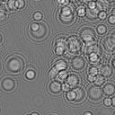
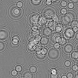
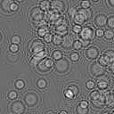
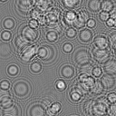
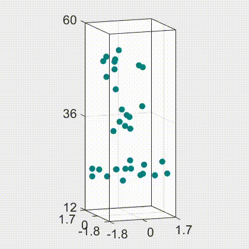
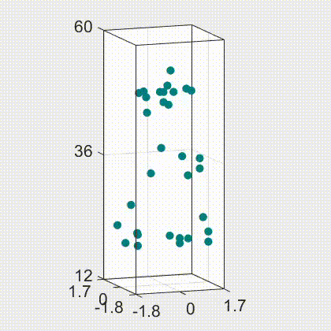
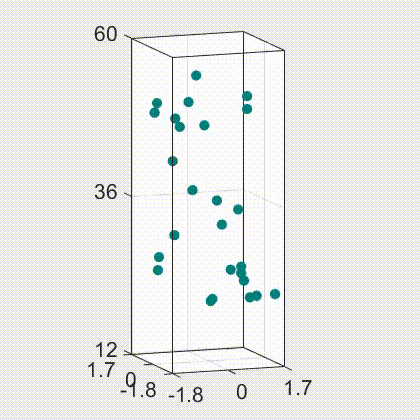

<h2 class="section-title"> Model-based Deep 3D holographic imaging  </h2>
<h5 class="pubname"> IEEE Transaction on Computational Imaging, 2021 </h5>
<nav class="text-center" style="width: 100%">
  <a href="https://ni-chen.github.io/" class="author">Ni Chen,</a>
  <a href="http://congliwang.github.io/" class="author">Congli Wang,</a>
  <a href="http://vccimaging.org/People/heidriw/" class="author"> Wolfgang Heidrich </a>
</nav>
<nav>
 KAUST 
</nav>

<section class="container">
<abstract>
<h5 class="section-title">  Abstract  </h5>
Gabor holography is a simple and effective approach for 3D imaging. However, it suffers from a DC term, twin-image entanglement, and defocus noise. The conventional approach for solving this problem is either using an off-axis setup, or compressive holography. The former sacrifices simplicity, and the latter is computationally demanding and time consuming. To cope with this problem, we propose a model-based holographic network (MB-HoloNet) for 3D particle imaging. The free-space point spread function, which is essential for hologram reconstruction, is used as a prior in the MB-HoloNet. All parameters are learned end-to-end. The physical prior makes the network efficient and stable for both localization and 3D particle size reconstructions.
  
</abstract>
</section>

<!-- Framework -->
<section class="container">
<h5 class="section-title"> Framework </h5>
<figure>

<figcaption>
Fig. 1: Schematic diagram of the MB-HoloNet.
</figcaption>
</figure>
</section>

<!-- Results -->
<section class="container">
<h5 class="section-title"> Some results  </h5>
<figure>
  
  
  \
  
   
  
  
  
  

  <figcaption>
  Fig. 2: Sample holograms and the corresponding reconstructions.
  </figcaption>
</figure>
</section>

<!-- Data -->

<!-- Downloads -->
<section class="container">
<h5 class="section-title">  Downloads </h5>

The manuscript link  | Github project link 

</section> 

<section class="container">
<h5 class="section-title"> Bibtex </h5>
<pre>
@article{Chen2020TCI,
title      = {Holographic {3D} particle imaging with model-based network},
author     = {Ni Chen and Congli Wang and Wolfgang Heidrich*},
correspond = {Wolfgang Heidrich},
journal    = {IEEE Transaction on Computational Imaging},
volume     = {7},
year       = {2021},
month      = {March},
doi        = {10.1109/TCI.2021.3063870},
url        = {http://hdl.handle.net/10754/666339},
}
</pre>
</section>

